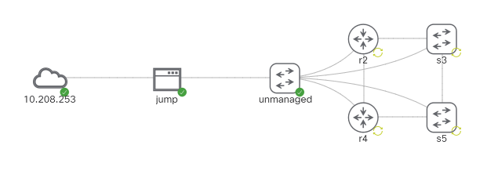

# Building Network Automation Solutions

[CML<sup>2</sup> Lab Setup](#cisco-cml2-lab-setup)

[Ansible](#ansible)

[Python Dependency Management](#python-dependency-management)

## <a name="cisco-cml2-lab-setup"></a> Cisco CML<sup>2</sup> Lab Setup

- The CML lab is defined in the file `basic-lab.yaml`

- Quick-n-dirty driving of the CML API using a **VSCode REST Client** script



### Prepare

Start VScode from the command line with the environment variable CML_PASS set
to CML password.


    CML_PASS=<password> code

The lab file `basic-lab.yaml` contains boot config for the CML nodes, e.g. 
- ip addressing
- public key of the control node in the Ubuntu jumphost
- minimum config for the switches and routers

Operate the Lab using the VSCode REST Client script `cml-lab-create-destroy.http`

Edit the REST client script to configure:
- the URL of CML 
- the `lab-title` variable set to the name of the lab definition YAML file.
- the CML user name (CML password comes from the env var CML_PASS entered when starting VSCode)

### Start the Lab

Use the REST client script sections to start the Lab

- Authenticate
- Create
- Start

Once all Lab nodes have started clear old ssh host keys and load new ones by
running the script `load-known_hosts.sh`

### Stop and Remove the Lab

Use the script sections to shutdown the Lab

- Stop
- Wipe
- Delete

### Ubuntu Jumphost inside CML<sup>2</sup> Emulation Lab

_NOTE: there is an annoying delay in booting the Ubuntu image caused by some
problem with "systemd-networkd-wait-online.service" not completing and
hitting it's timeout. This is adding two minutes to the boot time. A rabbit
hole for another day._

CML External Cloud Connector in bridge mode connecting to dual homed Ubuntu
acting as a jumphost named `jh`:

- NIC `enp0s2` external facing with IP address `10.208.253.102` defgwy `.1`
- NIC `enp0s3` Lab facing with IP address `192.168.1.1/24`

The CML Ubuntu image is cloud-init enabled. We only get to see the
cloud-config sub-mode so to configure network settings we need to hack on the
Ubuntu weirdness that is netplan e.g.

```yaml
      write_files:
        - path:  /etc/netplan/50-cloud-init.yaml
          permissions: '0644'
          content: |
            network:
              version: 2
              ethernets:
                enp0s2:
                  addresses: [10.208.253.102/24]
                  gateway4: 10.208.253.1
                enp0s3:
                  addresses: [192.168.1.1/24]
      runcmd:
        - [netplan, generate]
        - [netplan, apply]
```

## Ansible

- Operate ansible within a python virtual environment (venv)
- This project uses [pip-tools](https://github.com/jazzband/pip-tools) for
python dependency management

## Setup Ansible

Create a python virtual env with pip-tools installed:

    python -m venv venv
    . ./venv/bin/activate
    python -m pip install -U setuptools pip pip-tools

Synchronise the current venv from the "requirements.txt" file:

    python -m piptools sync requirements.txt

### Validate Ansible Connectivity

    ansible -m cli_command -a "command='sh ver'" all

## <a name="python-dependency-management"></a> Python Dependency Management

This project uses [pip-tools](https://github.com/jazzband/pip-tools) to manage
Python dependencies.

Recommended to operate in a python3 virtual environment (venv). Check the
expected venv is active with `which python` (on Windows `where python`)


### Managing requirements.txt

The "requirements.txt" file is managed by the pip-tools "compile" command.
The "compile" command reads input from the "requirements.in" file.

To create or update "requirements.txt" from "requirements.in":

    python -m piptools compile requirements.in


### Python Development Environment dev-requirements.txt

pip-tools can cleanly manage a dev environment using "dev-requirements.in" and
"dev-requirements.txt".   Configure "dev-requirements.in" with the desired dev tools.

Create or update the "dev-requiremnts.txt" file:

    python -m piptools compile dev-requirements.in

Synchronise the virtual environment from both the standard requirements and the
dev-requirements:

    python -m piptools sync requirements.txt dev-requirements.txt

To remove the dev tools perform a sync from "requirements.txt" only.
